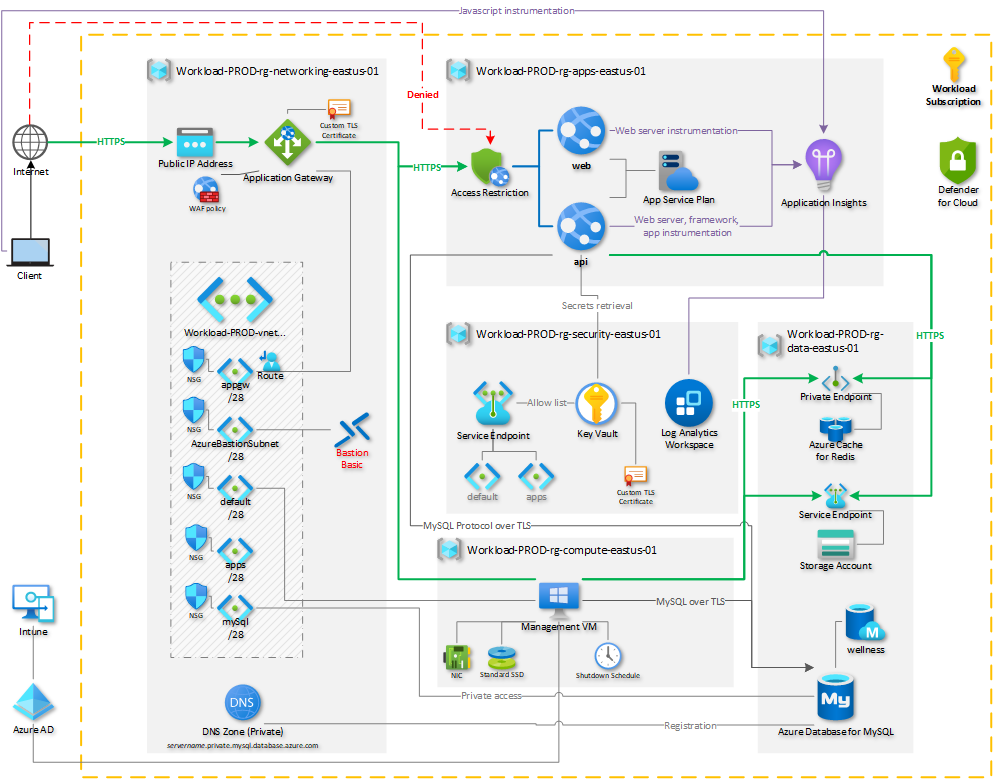

# Comprehensive Azure Web App Templates

These set of templates deploy the resources in the architecture diagram below:

*Download a [Visio file](docs/Architecture.vsdx) (.vsdx) of this architecture*

## Usage

### main.bicep

This is the template that will be deployed.

### deploy.ps1

This PowerShell script will deploy your main.bicep template. It has numerous parameters which will be passed on to main.bicep.

### contoso-com.pfx

This is a sample TLS certificate file for importing in Key Vault if TLS configuration for Application Gateway is desired, but a custom PFX is not readily available. It is a self-signed certificate with password `Azure123456!`.

### common-modules

The modules in this folder are modules that contain re-usable outputs.

### modules

The modules in this folder create the Azure resources. Many have parameters to enhance their flexibility and reusability.

## Parameters

Review the [deploy.user-sample.ps1](deploy.user-sample.ps1) file for an example of providing parameters to deploy.ps1.

Here are the common parameters defined by the template main.bicep:

* **location**: The Azure region to target for deployments.
* **environment**: An environment value, such as "dev."
* **workloadName**: The name of the workload to be deployed. This will be used to name deployments and to complete the naming convention.
* **sequence** (optional, defaults to `1`)
* **tags** (optional, defaults to none)
* **namingConvention** (optional, defaults to `{wloadname}-{env}-{rtype}-{loc}-{seq}`): the structure of the Azure resources names. Use placeholders as follows:
  * **{rtype}**: The resource type. Your main.bicep should replace {rtype} with the recommended Azure resource type abbreviation as found at <https://docs.microsoft.com/azure/cloud-adoption-framework/ready/azure-best-practices/resource-abbreviations>.
  * **{wloadname}**: Replaced with the value of the `workloadName` parameter.
  * **{env}**: Replaced with the value of the `environment` parameter.
  * **{loc}**: Replaced with the value of the `location` parameter.
  * **{seq}**: Replaced with the string value of the sequence parameter, always formatted as two digits.

These parameters are passed to the deployment from the PowerShell script using the `$TemplateParameters` object, which uses parameter splatting for increased resilience.
